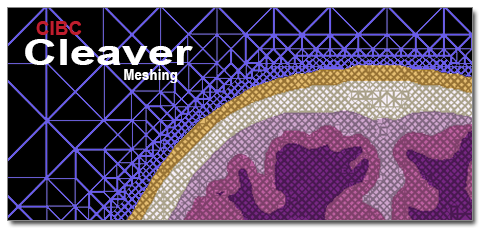

# Cleaver

Cleaver is a multi-material tetrahedral meshing tool

<p align="center">
  
</p>

## Overview

Cleaver creates conforming tetrahedral meshes for multimaterial or multiphase volumetric data in which both geometric accuracy and element quality are
bounded.

## Method

The Cleaver Library is based on the `Lattice Cleaving` algorithm.

The method is a stencil-based approach, and relies on an octree structure to provide a coarse level of grading in regions of homogeneity. The cleaving algorithm works by utilizing indicator functions, which indicate the strength or relative presence of a particular material. At each point, only the
material with the largest indicator value is considered present.

The method is theoretically guaranteed to produce valid meshes with bounded dihedral angles, while still conforming to multimaterial material sur-
faces. Empirically these bounds have been shown to be well within useful ranges, thus creating efficient meshes for analysis, simulation, and visualization.

Reference:

> Bronson J., Levine, J., Whitaker R., "Lattice Cleaving: Conforming Tetrahedral Meshes of Multimaterial Domains with Bounded Quality". Proceedings of the 21st International Meshing Roundtable (San Jose, CA, Oct 7-10, 2012)
>
> See https://www.ncbi.nlm.nih.gov/pmc/articles/PMC4190882/

## Documentation

Refer to the [documentation](https://cleaver2.readthedocs.io) for detailed installation and usage details.

For general questions about the project, its applications, or about software usage, please create a discussion in [Cleaver2/discussions](https://github.com/SCIInstitute/Cleaver2/discussions) where the community can collectively address your questions.

## Authors

Cleaver was developed by the NIH Center for Integrative Biomedical Computing at the University of Utah Scientific Computing and Imaging (SCI) Institute.

Please take a look at the [contributors page](https://github.com/SCIInstitute/Cleaver2/graphs/contributors) to learn more about the developers of Cleaver.

## Acknowledgement

This project was supported by the National Institute of General Medical Sciences of the National Institutes of Health under grant numbers P41 GM103545 and R24 GM136986.

## Citing Cleaver

If you are using Cleaver in your scientific research, please help our scientific visibility by citing our work.

> Cleaver: A MultiMaterial Tetrahedral Meshing Library and Application. Scientific Computing and Imaging Institute (SCI), Download from: http://www.sci.utah.edu/cibc/software.html, 2015.

BibTex:

```
@Misc{SCI:Cleaver,
  author =    "CIBC",
  year =      "2015",
  note =      "Cleaver: A MultiMaterial Tetrahedral Meshing
              Library and Application. Scientific Computing and
              Imaging Institute (SCI), Download from:
              http://www.sci.utah.edu/cibc/software.html",
  keywords =  "Cleaver, CIBC",
}
```
